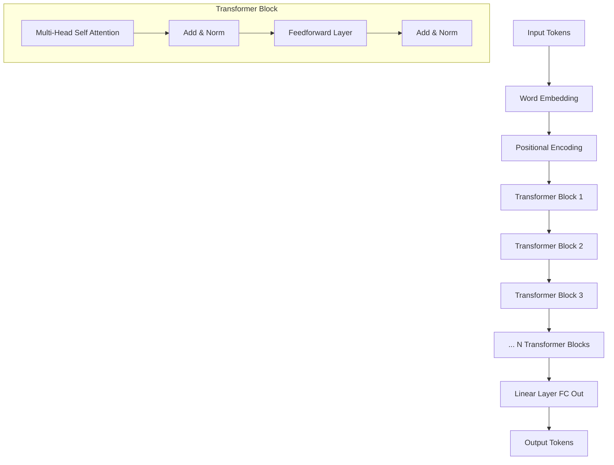

# Building a Basic Transformer Architecture from Scratch: A Step-by-Step Guide

Large Language Models (LLMs) like OpenAI’s GPT (Generative Pretrained Transformer) have revolutionized natural language processing (NLP). These models are capable of generating text, answering questions, performing translations, and much more. The GPT architecture itself is based on a decoder-only Transformer, which focuses on generating text autoregressively — one token at a time, based on previous tokens.

In this blog, we’ll go through the process of building a basic Transformer model in Python from scratch, training it on a small text dataset, and implementing text generation using autoregressive decoding.

## Table of Contents
1. Introduction to Transformers and GPT
2. Building the Transformer Architecture
3. Preparing the Data
4. Training the Model
5. Implementing Text Generation Using Auto-Regressive Decoding
6. Conclusion

---

## 1. Introduction to Transformers and GPT

### Transformers
Transformers have become the de facto architecture for solving many NLP tasks. The key components of a Transformer include multi-head attention and feedforward layers. These layers allow models to handle long-range dependencies in sequences efficiently. A GPT model is a decoder-only Transformer that autoregressively predicts the next token given a sequence of previous tokens.

### GPT Architecture
GPT uses the following architecture:
- **Input Embeddings**: Converts input tokens into dense vectors.
- **Positional Encodings**: Adds information about the position of tokens since Transformers don't have a sense of order by default.
- **Decoder Blocks**: Consists of multi-head self-attention and feedforward layers.
- **Output Head**: Generates predictions for the next token.

Let’s get into building this model!

---

## 2. Building the Transformer Architecture

We will start by implementing the core building blocks of the GPT architecture: Multi-Head Self-Attention, Positionwise Feedforward Layers, and Positional Embeddings. We will then stack these components to form the GPT-like Transformer.

### Step 1: Import Libraries

```python
import numpy as np
import torch
import torch.nn as nn
import torch.nn.functional as F
```

### Step 2: Multi-Head Self-Attention Mechanism

Self-attention allows the model to attend to different parts of the input sequence. Multi-head attention uses several attention heads, each learning different aspects of the input sequence.

```python
class MultiHeadSelfAttention(nn.Module):
    def __init__(self, embed_size, heads):
        super(MultiHeadSelfAttention, self).__init__()
        self.embed_size = embed_size
        self.heads = heads
        self.head_dim = embed_size // heads

        assert (
            self.head_dim * heads == embed_size
        ), "Embedding size needs to be divisible by heads"

        self.values = nn.Linear(self.head_dim, embed_size, bias=False)
        self.keys = nn.Linear(self.head_dim, embed_size, bias=False)
        self.queries = nn.Linear(self.head_dim, embed_size, bias=False)
        self.fc_out = nn.Linear(embed_size, embed_size)

    def forward(self, values, keys, query, mask):
        N = query.shape[0]
        value_len, key_len, query_len = values.shape[1], keys.shape[1], query.shape[1]

        # Split the embedding into self.heads different pieces
        values = values.reshape(N, value_len, self.heads, self.head_dim)
        keys = keys.reshape(N, key_len, self.heads, self.head_dim)
        queries = query.reshape(N, query_len, self.heads, self.head_dim)

        # Scaled dot-product attention
        energy = torch.einsum("nqhd,nkhd->nhqk", [queries, keys])
        if mask is not None:
            energy = energy.masked_fill(mask == 0, float("-1e20"))
        
        attention = torch.softmax(energy / (self.embed_size ** (1 / 2)), dim=3)

        out = torch.einsum("nhql,nlhd->nqhd", [attention, values]).reshape(
            N, query_len, self.embed_size
        )

        out = self.fc_out(out)
        return out
```

### Step 3: Positional Encoding

Positional encodings are added to the input embeddings to provide the model with information about the order of tokens.

```python
class PositionalEncoding(nn.Module):
    def __init__(self, embed_size, max_len=100):
        super(PositionalEncoding, self).__init__()
        self.encoding = torch.zeros(max_len, embed_size)
        self.encoding.requires_grad = False

        pos = torch.arange(0, max_len).unsqueeze(1).float()
        two_i = torch.arange(0, embed_size, 2).float()

        self.encoding[:, 0::2] = torch.sin(pos / (10000 ** (two_i / embed_size)))
        self.encoding[:, 1::2] = torch.cos(pos / (10000 ** (two_i / embed_size)))

    def forward(self, x):
        batch_size, seq_len = x.size(0), x.size(1)
        return x + self.encoding[:seq_len, :].to(x.device)
```

### Step 4: Transformer Block

A single Transformer block consists of multi-head attention followed by a feedforward network. We’ll also use layer normalization and residual connections for stability.

```python
class TransformerBlock(nn.Module):
    def __init__(self, embed_size, heads, dropout):
        super(TransformerBlock, self).__init__()
        self.attention = MultiHeadSelfAttention(embed_size, heads)
        self.norm1 = nn.LayerNorm(embed_size)
        self.norm2 = nn.LayerNorm(embed_size)
        self.feed_forward = nn.Sequential(
            nn.Linear(embed_size, embed_size * 4),
            nn.ReLU(),
            nn.Linear(embed_size * 4, embed_size),
        )
        self.dropout = nn.Dropout(dropout)

    def forward(self, value, key, query, mask):
        attention = self.attention(value, key, query, mask)
        x = self.dropout(self.norm1(attention + query))
        forward = self.feed_forward(x)
        out = self.dropout(self.norm2(forward + x))
        return out
```

### Step 5: GPT Model

Finally, we’ll stack multiple Transformer blocks to create the overall GPT architecture.

```python
class GPT(nn.Module):
    def __init__(self, vocab_size, embed_size, num_layers, heads, device, dropout, max_length):
        super(GPT, self).__init__()
        self.device = device
        self.embed_size = embed_size
        self.word_embedding = nn.Embedding(vocab_size, embed_size)
        self.position_embedding = PositionalEncoding(embed_size, max_length)
        self.layers = nn.ModuleList(
            [TransformerBlock(embed_size, heads, dropout) for _ in range(num_layers)]
        )
        self.fc_out = nn.Linear(embed_size, vocab_size)
        self.dropout = nn.Dropout(dropout)

    def forward(self, x, mask):
        N, seq_length = x.shape
        positions = torch.arange(0, seq_length).expand(N, seq_length).to(self.device)
        out = self.dropout(self.word_embedding(x) + self.position_embedding(positions))

        for layer in self.layers:
            out = layer(out, out, out, mask)

        logits = self.fc_out(out)
        return logits
```

---

## 3. Preparing the Data

We’ll now move to preparing a small text dataset for training. For simplicity, we’ll use a small corpus of text (like book chapters or articles).

### Step 1: Tokenization

We need to tokenize the text data and convert it into numerical representations that the model can understand.

```python
from collections import Counter
import re

def tokenize(text):
    tokens = re.findall(r'\w+', text.lower())
    return tokens

def build_vocab(text):
    tokens = tokenize(text)
    vocab = Counter(tokens)
    vocab = {word: idx for idx, (word, _) in enumerate(vocab.most_common())}
    return vocab

def encode(text, vocab):
    tokens = tokenize(text)
    return [vocab[token] for token in tokens if token in vocab]
```

---

## 4. Training the Model

### Step 1: Training Loop

We’ll use a cross-entropy loss function and the Adam optimizer to train the model.

```python
def train(model, data, vocab, epochs=10, lr=1e-4):
    optimizer = torch.optim.Adam(model.parameters(), lr=lr)
    criterion = nn.CrossEntropyLoss()

    model.train()
    for epoch in range(epochs):
        total_loss = 0
        for batch in data:
            inputs = torch.tensor(batch[:-1], dtype=torch.long).to(model.device)
            targets = torch.tensor(batch[1:], dtype=torch.long).to(model.device)
            mask = None

            optimizer.zero_grad()
            output = model(inputs, mask)
            loss = criterion(output.view(-1, output.size(-1)), targets.view(-1))
            loss.backward()
            optimizer.step()

            total_loss += loss.item()
        print(f"Epoch {epoch + 1}, Loss: {total_loss / len(data)}")
```

### Step 2: Dummy Data for Testing

```python
text = "This is a small test dataset for GPT training."
vocab = build_vocab(text)
encoded_text = encode(text, vocab)
```

---

## 5. Implementing Text Generation Using Auto-Regressive Decoding

Once the model is trained, we can use it to generate text. We start with a prompt, feed it into the model, and use the model’s output to predict the next word. This process is repeated

 to generate a sequence of text.

```python
def generate_text(model, prompt, vocab, max_len=50):
    model.eval()
    words = tokenize(prompt)
    inputs = torch.tensor([vocab.get(word, 0) for word in words], dtype=torch.long).unsqueeze(0).to(model.device)
    
    for _ in range(max_len):
        mask = None
        with torch.no_grad():
            output = model(inputs, mask)
            next_token_logits = output[0, -1, :]
            predicted_token = torch.argmax(next_token_logits).item()
            inputs = torch.cat([inputs, predicted_token.unsqueeze(0)], dim=1)
    
    decoded_sentence = ' '.join([list(vocab.keys())[i] for i in inputs[0].tolist()])
    return decoded_sentence
```

---

## 6. Conclusion

In this blog, we walked through how to build a basic GPT-like model from scratch in Python using PyTorch. We constructed the core Transformer architecture, trained the model on a small dataset, and implemented autoregressive text generation. Although this is a simplified version, it forms the basis for more sophisticated architectures like GPT-3 and GPT-4.

This process gives a deeper understanding of how Transformers and GPT models work.


## Architecture using Mermaid syntax:




In this diagram:

- **Input Tokens** are passed through the **Word Embedding** and **Positional Encoding** layers.
- The encoded input is passed through several **Transformer Blocks**, each containing **Multi-Head Self Attention**, **Feedforward**, and **Add & Norm** layers.
- Finally, the output from the last Transformer block is passed through a **Linear Layer (FC Out)**, which predicts the next token.

This visual flow should help clarify how the components of the GPT-like architecture fit together!
