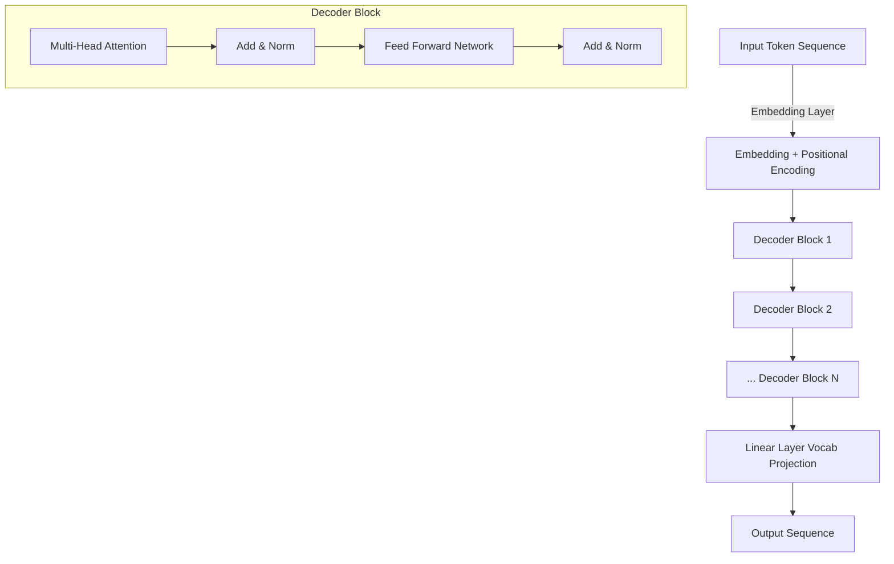

# Building LLaMA from Scratch: A Step-by-Step Guide to Implementing a Lightweight Transformer

Transformers have revolutionized the field of natural language processing (NLP), and recently, Meta's LLaMA (Large Language Model Meta AI) has shown remarkable efficiency. LLaMA is a smaller and more efficient decoder-only transformer that rivals larger models like GPT-3 in performance but with significantly fewer parameters. In this blog, we'll walk through how to build LLaMA from scratch using Python and PyTorch, train it on a small dataset, and fine-tune it for tasks like conversational AI and text completion.

## Table of Contents:
1. Introduction to Transformers and LLaMA
2. Building the Lightweight Transformer Model
3. Training the Model on a Small Dataset
4. Fine-tuning LLaMA for Conversational AI and Text Completion
5. Conclusion

---

## 1. Introduction to Transformers and LLaMA

Transformers have been a cornerstone for tasks such as language generation, text completion, machine translation, and question-answering. However, their large parameter size makes them resource-intensive to train and deploy. Meta's LLaMA is designed as a more compact yet efficient decoder-only transformer, making it easier to implement, train, and deploy for specific tasks.

**Key features of LLaMA:**
- A smaller and more efficient architecture.
- Comparable performance to larger models like GPT-3.
- Suitable for a variety of text generation tasks, including conversational AI.

In this blog, we will build a basic transformer model like LLaMA, train it on a small dataset, and fine-tune it for specific tasks.

---

## 2. Building the Lightweight Transformer Model

We will start by implementing the core components of a transformer architecture: the attention mechanism, the decoder blocks, and the output generation mechanism. We'll use PyTorch, which provides excellent flexibility for building custom models.

### Step 1: Install Required Libraries

```bash
pip install torch transformers datasets
```

### Step 2: Implement the Scaled Dot-Product Attention

The attention mechanism is the backbone of transformers. We will implement the scaled dot-product attention, which is the foundation of the decoder blocks.

```python
import torch
import torch.nn as nn
import torch.nn.functional as F

class ScaledDotProductAttention(nn.Module):
    def __init__(self, d_model):
        super(ScaledDotProductAttention, self).__init__()
        self.scale = 1 / (d_model ** 0.5)

    def forward(self, query, key, value, mask=None):
        scores = torch.matmul(query, key.transpose(-2, -1)) * self.scale
        
        if mask is not None:
            scores = scores.masked_fill(mask == 0, float('-inf'))
        
        attn_weights = F.softmax(scores, dim=-1)
        output = torch.matmul(attn_weights, value)
        return output, attn_weights
```

### Step 3: Multi-Head Attention

Now, we'll implement the multi-head attention mechanism, which allows the model to attend to information from different representation subspaces.

```python
class MultiHeadAttention(nn.Module):
    def __init__(self, d_model, num_heads):
        super(MultiHeadAttention, self).__init__()
        self.d_model = d_model
        self.num_heads = num_heads
        self.head_dim = d_model // num_heads

        assert d_model % num_heads == 0, "d_model must be divisible by num_heads"

        self.query = nn.Linear(d_model, d_model)
        self.key = nn.Linear(d_model, d_model)
        self.value = nn.Linear(d_model, d_model)
        self.fc_out = nn.Linear(d_model, d_model)

    def forward(self, query, key, value, mask=None):
        batch_size = query.size(0)

        # Linear transformations
        Q = self.query(query)
        K = self.key(key)
        V = self.value(value)

        # Split into heads
        Q = Q.view(batch_size, -1, self.num_heads, self.head_dim).transpose(1, 2)
        K = K.view(batch_size, -1, self.num_heads, self.head_dim).transpose(1, 2)
        V = V.view(batch_size, -1, self.num_heads, self.head_dim).transpose(1, 2)

        # Apply scaled dot-product attention
        attn_output, _ = ScaledDotProductAttention(self.head_dim)(Q, K, V, mask)

        # Concatenate heads and apply final linear transformation
        attn_output = attn_output.transpose(1, 2).contiguous().view(batch_size, -1, self.d_model)
        output = self.fc_out(attn_output)
        return output
```

### Step 4: Transformer Decoder Block

Next, we'll build the transformer decoder block. This block consists of multi-head attention, feedforward layers, and layer normalization.

```python
class DecoderBlock(nn.Module):
    def __init__(self, d_model, num_heads, ff_hidden_dim, dropout=0.1):
        super(DecoderBlock, self).__init__()
        self.mha = MultiHeadAttention(d_model, num_heads)
        self.ffn = nn.Sequential(
            nn.Linear(d_model, ff_hidden_dim),
            nn.ReLU(),
            nn.Linear(ff_hidden_dim, d_model)
        )
        self.layernorm1 = nn.LayerNorm(d_model)
        self.layernorm2 = nn.LayerNorm(d_model)
        self.dropout = nn.Dropout(dropout)

    def forward(self, x, mask=None):
        # Multi-Head Attention
        attn_output = self.mha(x, x, x, mask)
        attn_output = self.dropout(attn_output)
        x = self.layernorm1(x + attn_output)

        # Feedforward Network
        ffn_output = self.ffn(x)
        ffn_output = self.dropout(ffn_output)
        x = self.layernorm2(x + ffn_output)
        
        return x
```

### Step 5: Build the Transformer Decoder

We will now stack multiple decoder blocks to create the full decoder model, which will be used to generate text.

```python
class LLaMADecoder(nn.Module):
    def __init__(self, vocab_size, d_model, num_heads, num_layers, ff_hidden_dim, max_seq_len, dropout=0.1):
        super(LLaMADecoder, self).__init__()
        self.embedding = nn.Embedding(vocab_size, d_model)
        self.positional_encoding = nn.Parameter(torch.zeros(1, max_seq_len, d_model))
        self.layers = nn.ModuleList([DecoderBlock(d_model, num_heads, ff_hidden_dim, dropout) for _ in range(num_layers)])
        self.fc_out = nn.Linear(d_model, vocab_size)
        self.dropout = nn.Dropout(dropout)

    def forward(self, x, mask=None):
        # Embedding + Positional Encoding
        x = self.embedding(x) + self.positional_encoding[:, :x.size(1), :]
        x = self.dropout(x)

        # Apply decoder blocks
        for layer in self.layers:
            x = layer(x, mask)

        logits = self.fc_out(x)
        return logits
```

### Step 6: Positional Encoding

Positional encodings are crucial for transformers to understand the sequential nature of the input data. We've included it as part of the `LLaMADecoder` above.

---

## 3. Training the Model on a Small Dataset

Now that we have built the core LLaMA model, we can train it on a small dataset. For this example, we'll use a toy dataset from the Hugging Face `datasets` library to demonstrate training.

### Step 1: Load the Dataset

```python
from datasets import load_dataset

dataset = load_dataset("wikitext", "wikitext-2-raw-v1")
train_data = dataset['train']['text'][:1000]  # Limit to 1000 sentences for demo
```

### Step 2: Tokenize the Data

We'll use the tokenizer from the `transformers` library to prepare the data for training.

```python
from transformers import GPT2Tokenizer

tokenizer = GPT2Tokenizer.from_pretrained('gpt2')

def tokenize_data(data):
    return tokenizer(data, return_tensors="pt", truncation=True, padding="max_length", max_length=128)

train_tokens = [tokenize_data(sentence) for sentence in train_data]
```

### Step 3: Train the Model

We'll train the model using a standard training loop in PyTorch.

```python
import torch.optim as optim

# Hyperparameters
d_model = 512
num_heads = 8
num_layers = 6
ff_hidden_dim = 2048
max_seq_len = 128
vocab_size = tokenizer.vocab_size
dropout = 0.1
epochs = 5

model = LLaMADecoder(vocab_size, d_model, num_heads, num_layers, ff_hidden_dim, max_seq_len, dropout).to("cuda")
optimizer = optim.Adam(model.parameters(), lr=5e-5)
criterion = nn.CrossEntropyLoss()

def train_model(model, train_tokens, epochs):
    model.train()
    for epoch in range(epochs):
        for i, tokens in enumerate(train_tokens):
            inputs = tokens["input_ids"].to("cuda")
            labels = tokens["input_ids"].to("cuda")

            optimizer.zero_grad()
            outputs = model(inputs)
            loss = criterion(outputs.view(-1, vocab_size), labels.view(-1))
            loss.backward()
            optimizer.step()

            if i % 100 == 0:
                print(f'Epoch {epoch}, Step {i}, Loss: {loss.item()}')

train_model(model, train_tokens, epochs)


```

---

## 4. Fine-tuning LLaMA for Conversational AI and Text Completion

Once the model has been trained on the initial dataset, you can fine-tune it for specific tasks such as conversational AI or text completion. Fine-tuning involves continuing the training process on a dataset specific to the task.

### Step 1: Prepare the Conversational Dataset

You can use datasets like `Persona-Chat` from Hugging Face for fine-tuning.

```python
chat_dataset = load_dataset("blended_skill_talk", split="train")

def tokenize_chat_data(data):
    return tokenizer(data['text'], return_tensors="pt", truncation=True, padding="max_length", max_length=128)

chat_train_tokens = [tokenize_chat_data(sentence) for sentence in chat_dataset[:500]]
train_model(model, chat_train_tokens, epochs)
```

---

## 5. Conclusion

In this blog, we’ve walked through building a lightweight transformer-based language model like LLaMA from scratch using PyTorch. We covered the key steps, including the scaled dot-product attention mechanism, multi-head attention, and transformer decoder blocks. We also demonstrated how to train the model on a small dataset and fine-tune it for specific tasks like conversational AI.

With this foundation, you can further experiment with model architectures, datasets, and fine-tuning techniques to adapt the model for your specific needs.


## Architecture using Mermaid syntax:


