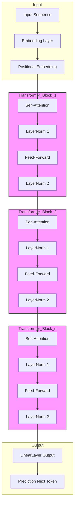

### Building an OPT Model from Scratch in Python: A Comprehensive Guide

In this blog, we will walk through the process of building a basic version of the **Open Pretrained Transformer (OPT)**, a lightweight alternative to GPT developed by Meta. We will cover three main steps: 

1. **Building the OPT Architecture**
2. **Pretraining the Model on a Small Dataset**
3. **Fine-tuning the Model for Specialized Tasks like Summarization and Classification**

Let’s dive right in!

---

## Part 1: Building the OPT Architecture

The OPT architecture is based on the Transformer model, leveraging both self-attention and feed-forward networks. In this section, we'll implement the OPT architecture from scratch using Python and PyTorch.

### Step 1.1: Setting up the environment

First, ensure you have the necessary libraries installed. You will need PyTorch, tokenizers, and datasets for managing the data pipeline.

```bash
pip install torch transformers datasets tokenizers
```

### Step 1.2: Import required libraries

We start by importing essential libraries and modules for model creation and training.

```python
import torch
import torch.nn as nn
import torch.optim as optim
from torch.nn import functional as F
from transformers import AutoTokenizer, get_scheduler
from datasets import load_dataset
import math
```

### Step 1.3: Define the OPT model architecture

The OPT architecture is quite similar to the GPT model, as both follow the Transformer architecture. We'll start by building an essential block: the Transformer decoder.

```python
class OPTSelfAttention(nn.Module):
    def __init__(self, embed_size, num_heads):
        super(OPTSelfAttention, self).__init__()
        self.num_heads = num_heads
        self.embed_size = embed_size

        self.values = nn.Linear(embed_size, embed_size, bias=False)
        self.keys = nn.Linear(embed_size, embed_size, bias=False)
        self.queries = nn.Linear(embed_size, embed_size, bias=False)
        self.fc_out = nn.Linear(embed_size, embed_size)

    def forward(self, x):
        N, seq_length, embed_size = x.shape
        values = self.values(x)
        keys = self.keys(x)
        queries = self.queries(x)

        # Split embedding into self.num_heads different heads
        values = values.view(N, seq_length, self.num_heads, self.embed_size // self.num_heads)
        keys = keys.view(N, seq_length, self.num_heads, self.embed_size // self.num_heads)
        queries = queries.view(N, seq_length, self.num_heads, self.embed_size // self.num_heads)

        energy = torch.einsum("nqhd,nkhd->nhqk", [queries, keys])
        attention = torch.softmax(energy / (self.embed_size ** (1 / 2)), dim=3)

        out = torch.einsum("nhql,nlhd->nqhd", [attention, values]).reshape(N, seq_length, self.embed_size)
        out = self.fc_out(out)
        return out
```

### Step 1.4: Build the Decoder Block

Next, we define a transformer block that uses the self-attention mechanism and a feed-forward network.

```python
class OPTBlock(nn.Module):
    def __init__(self, embed_size, num_heads, forward_expansion):
        super(OPTBlock, self).__init__()
        self.attention = OPTSelfAttention(embed_size, num_heads)
        self.norm1 = nn.LayerNorm(embed_size)
        self.norm2 = nn.LayerNorm(embed_size)

        self.feed_forward = nn.Sequential(
            nn.Linear(embed_size, forward_expansion * embed_size),
            nn.ReLU(),
            nn.Linear(forward_expansion * embed_size, embed_size),
        )

    def forward(self, x):
        attention = self.attention(x)
        x = self.norm1(attention + x)
        forward = self.feed_forward(x)
        x = self.norm2(forward + x)
        return x
```

### Step 1.5: Define the OPT Model

Now we can combine several transformer blocks into the final model.

```python
class OPTModel(nn.Module):
    def __init__(self, embed_size, num_heads, num_layers, vocab_size, max_length, forward_expansion):
        super(OPTModel, self).__init__()
        self.embed_size = embed_size
        self.word_embedding = nn.Embedding(vocab_size, embed_size)
        self.position_embedding = nn.Embedding(max_length, embed_size)

        self.layers = nn.ModuleList([
            OPTBlock(embed_size, num_heads, forward_expansion)
            for _ in range(num_layers)
        ])

        self.fc_out = nn.Linear(embed_size, vocab_size)

    def forward(self, x):
        N, seq_length = x.shape
        positions = torch.arange(0, seq_length).expand(N, seq_length).to(x.device)
        out = self.word_embedding(x) + self.position_embedding(positions)

        for layer in self.layers:
            out = layer(out)

        out = self.fc_out(out)
        return out
```

## Part 2: Pretraining the Model on a Small Dataset

To pretrain our OPT model, we need a dataset. For simplicity, we’ll use a small language modeling dataset, such as the `wikitext` dataset, and pretrain our model on it.

### Step 2.1: Load and tokenize the dataset

```python
tokenizer = AutoTokenizer.from_pretrained("gpt2")

# Load dataset
dataset = load_dataset("wikitext", "wikitext-2-raw-v1")

# Tokenize data
def tokenize_function(examples):
    return tokenizer(examples["text"], return_tensors="pt", padding="max_length", max_length=128, truncation=True)

tokenized_datasets = dataset.map(tokenize_function, batched=True, remove_columns=["text"])
```

### Step 2.2: Pretraining the OPT Model

Define the training loop and the optimizer. We will train the model using a simple cross-entropy loss function.

```python
def train_model(model, tokenized_datasets, epochs=3, batch_size=16, lr=1e-4):
    optimizer = optim.Adam(model.parameters(), lr=lr)
    scheduler = get_scheduler("linear", optimizer=optimizer, num_warmup_steps=100, num_training_steps=len(tokenized_datasets) * epochs)

    train_dataloader = torch.utils.data.DataLoader(tokenized_datasets["train"], batch_size=batch_size)

    for epoch in range(epochs):
        for batch in train_dataloader:
            optimizer.zero_grad()
            input_ids = batch["input_ids"].squeeze().to(device)
            output = model(input_ids)

            loss = F.cross_entropy(output.view(-1, model.fc_out.out_features), input_ids.view(-1))
            loss.backward()
            optimizer.step()
            scheduler.step()

        print(f"Epoch {epoch + 1}/{epochs} completed. Loss: {loss.item()}")

# Train the model
device = torch.device("cuda" if torch.cuda.is_available() else "cpu")
model = OPTModel(embed_size=512, num_heads=8, num_layers=6, vocab_size=len(tokenizer), max_length=128, forward_expansion=4).to(device)
train_model(model, tokenized_datasets)
```

## Part 3: Fine-tuning for Specialized Tasks (Summarization or Classification)

Fine-tuning the model for specific tasks is essential for real-world applications. Here, we will demonstrate how to fine-tune the pretrained model for text summarization or classification.

### Step 3.1: Fine-tuning for Text Summarization

Let’s use a dataset like `CNN/DailyMail` for fine-tuning.

```python
# Load summarization dataset
summarization_dataset = load_dataset("cnn_dailymail", "3.0.0")

# Tokenize input for summarization
def tokenize_sum(examples):
    model_inputs = tokenizer(examples["article"], truncation=True, padding="max_length", max_length=512)
    with tokenizer.as_target_tokenizer():
        labels = tokenizer(examples["highlights"], truncation=True, padding="max_length", max_length=128)
    model_inputs["labels"] = labels["input_ids"]
    return model_inputs

tokenized_summarization_dataset = summarization_dataset.map(tokenize_sum, batched=True)
```

### Step 3.2: Fine-tuning for Classification

Alternatively, for classification tasks like sentiment analysis, use the `IMDb` dataset.

```python
# Load IMDb dataset
classification_dataset = load_dataset("imdb")

# Tokenize for classification
def tokenize_classification(examples):
    return tokenizer(examples["text"], padding="max_length", truncation=True, max_length=512)

tokenized_classification_dataset = classification_dataset.map(tokenize_classification, batched=True)
```

### Step 3.3: Training Loop for Fine-tuning

Fine-tuning requires modifying the training loop for task-specific labels.

```python
def fine_tune_model(model, dataset, task_type="classification", epochs=3, batch_size=16, lr=1e-4):
    optimizer = optim.Adam(model.parameters(), lr=lr)
    scheduler = get_scheduler("linear", optimizer=optimizer, num_warmup_steps=100, num_training_steps=len(dataset) * epochs)
    dataloader = torch.utils.data.DataLoader(dataset, batch_size=batch_size)

    for epoch in range(epochs):
        for batch in dataloader:
            optimizer.zero_grad()
            input_ids = batch["input_ids"].squeeze().to(device)

            if task_type == "summarization":
                labels = batch["labels"].to(device)
                outputs = model(input_ids)
                loss = F.cross_entropy(outputs.view

(-1, model.fc_out.out_features), labels.view(-1))

            elif task_type == "classification":
                labels = batch["label"].to(device)
                outputs = model(input_ids)
                loss = F.cross_entropy(outputs.view(-1, model.fc_out.out_features), labels)

            loss.backward()
            optimizer.step()
            scheduler.step()

        print(f"Epoch {epoch + 1}/{epochs} completed. Loss: {loss.item()}")

# Example: Fine-tune for summarization
fine_tune_model(model, tokenized_summarization_dataset, task_type="summarization")
```

---

## Conclusion

In this blog, we’ve built a basic version of the **OPT model** from scratch, pretrained it using a small dataset, and fine-tuned it for tasks like text summarization and classification. Building these models from scratch offers a deep understanding of how Transformers work under the hood. Fine-tuning pre-trained models can be a powerful approach for solving specific NLP tasks with less computational effort.

---

**Next Steps:**
- Try scaling the model for larger datasets and more layers.
- Experiment with hyperparameter tuning to improve performance.
- Explore other tasks such as machine translation or question answering.


## Architecture using Mermaid syntax:




The diagram illustrates the key components like the input embedding, position embedding, transformer blocks (self-attention, layer normalization, feed-forward), and the final linear layer for output generation.

### Explanation:
- **Input Sequence:** The input tokenized sequence is passed to the model.
- **Embedding Layer:** Maps each token to a high-dimensional vector.
- **Positional Embedding:** Adds positional information to the embeddings to retain word order.
- **Transformer Blocks:** These blocks contain the self-attention mechanism, followed by layer normalization and feed-forward networks.
- **Linear Layer:** After passing through multiple transformer blocks, a final linear layer is used to predict the next token in the sequence.

You can adjust the number of transformer blocks depending on your architecture setup. Each block consists of self-attention, layer normalization, and feed-forward layers.