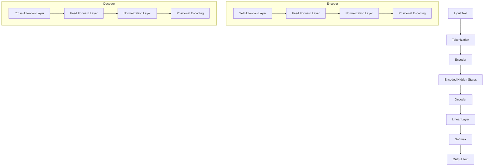

# Building and Fine-Tuning a T5 Model from Scratch in Python

In this blog, we will walk you through the process of building and fine-tuning a **T5 (Text-To-Text Transfer Transformer)** model using Python. T5 is a versatile encoder-decoder transformer model capable of handling a wide range of NLP tasks such as summarization, translation, text classification, and question-answering by converting all tasks into a text-to-text format.

The steps covered in this blog:
1. **Understanding the T5 architecture**: Encoder-decoder modules.
2. **Building the T5 model from scratch**: Implementing both encoder and decoder.
3. **Setting up task-specific datasets**: Preparing datasets for summarization, translation, and more.
4. **Training and fine-tuning the T5 model**: Fine-tuning the model for multiple text-to-text tasks.

### Requirements

Before we begin, make sure you have the necessary libraries installed:
```bash
pip install torch transformers datasets sentencepiece
```

### 1. Understanding the T5 Architecture

The T5 model is based on the Transformer architecture. The main difference between T5 and the original Transformer is that T5 reformulates all NLP tasks as a text-to-text problem. The architecture consists of two primary components:

- **Encoder**: Encodes the input text and creates hidden representations.
- **Decoder**: Generates the output text based on the hidden representations and the previous tokens.

Here's a simplified breakdown of the encoder-decoder structure:
- The **encoder** receives the input text tokens, processes them, and outputs a sequence of hidden states.
- The **decoder** takes these hidden states and produces a new sequence of tokens based on the given task (e.g., summarization, translation).

### 2. Building the T5 Model from Scratch

We will implement the core components of the T5 model in Python using PyTorch. This includes the encoder and decoder modules.

#### Step 1: Import Necessary Libraries

```python
import torch
import torch.nn as nn
from transformers import T5Tokenizer, T5ForConditionalGeneration

# Use T5 tokenizer to preprocess the data
tokenizer = T5Tokenizer.from_pretrained('t5-small')
```

#### Step 2: Define the Encoder

The encoder consists of self-attention layers and feed-forward networks. We will use the `nn.TransformerEncoderLayer` and `nn.TransformerEncoder` for building the encoder.

```python
class Encoder(nn.Module):
    def __init__(self, embed_dim, num_heads, ff_dim, num_layers):
        super(Encoder, self).__init__()
        self.embedding = nn.Embedding(tokenizer.vocab_size, embed_dim)
        encoder_layer = nn.TransformerEncoderLayer(embed_dim, num_heads, ff_dim)
        self.encoder = nn.TransformerEncoder(encoder_layer, num_layers)
    
    def forward(self, x):
        embedded = self.embedding(x)
        encoded_output = self.encoder(embedded)
        return encoded_output
```

#### Step 3: Define the Decoder

The decoder is similar to the encoder but includes additional cross-attention layers. It interacts with the encoder’s hidden states to generate the target output.

```python
class Decoder(nn.Module):
    def __init__(self, embed_dim, num_heads, ff_dim, num_layers):
        super(Decoder, self).__init__()
        self.embedding = nn.Embedding(tokenizer.vocab_size, embed_dim)
        decoder_layer = nn.TransformerDecoderLayer(embed_dim, num_heads, ff_dim)
        self.decoder = nn.TransformerDecoder(decoder_layer, num_layers)

    def forward(self, x, memory):
        embedded = self.embedding(x)
        decoded_output = self.decoder(embedded, memory)
        return decoded_output
```

#### Step 4: Define the Full T5 Model

Now that we have both encoder and decoder, let's define the full model that brings them together. The model will include the encoder, decoder, and a linear layer for output generation.

```python
class T5Model(nn.Module):
    def __init__(self, embed_dim, num_heads, ff_dim, num_layers):
        super(T5Model, self).__init__()
        self.encoder = Encoder(embed_dim, num_heads, ff_dim, num_layers)
        self.decoder = Decoder(embed_dim, num_heads, ff_dim, num_layers)
        self.output_layer = nn.Linear(embed_dim, tokenizer.vocab_size)

    def forward(self, input_ids, decoder_input_ids):
        encoder_output = self.encoder(input_ids)
        decoder_output = self.decoder(decoder_input_ids, encoder_output)
        output = self.output_layer(decoder_output)
        return output
```

### 3. Setting Up Task-Specific Datasets

T5 can handle a variety of tasks like summarization, translation, and text generation. Each task is represented as a string, which acts as a prefix in the input. The dataset used should be in a text-to-text format where the input is paired with the expected output.

We will use the HuggingFace `datasets` library to load common NLP datasets for tasks like summarization and translation.

#### Step 1: Load the Dataset

```python
from datasets import load_dataset

# Load the CNN/DailyMail dataset for summarization
dataset = load_dataset("cnn_dailymail", "3.0.0", split="train")
```

#### Step 2: Preprocess the Dataset

Tokenize the input and output text to prepare the dataset for the model.

```python
def preprocess_data(example):
    input_text = "summarize: " + example['article']
    target_text = example['highlights']
    input_ids = tokenizer.encode(input_text, max_length=512, truncation=True, padding="max_length")
    target_ids = tokenizer.encode(target_text, max_length=128, truncation=True, padding="max_length")
    return {"input_ids": input_ids, "target_ids": target_ids}

# Apply preprocessing
dataset = dataset.map(preprocess_data)
```

#### Step 3: Prepare DataLoader

Convert the dataset into a DataLoader that can feed batches into the model for training.

```python
from torch.utils.data import DataLoader

# Create a PyTorch DataLoader
train_loader = DataLoader(dataset, batch_size=8, shuffle=True)
```

### 4. Training and Fine-Tuning the T5 Model

Now, we will train the model on a text summarization task. For training, we will use a standard cross-entropy loss and an optimizer like AdamW.

#### Step 1: Define Loss Function and Optimizer

```python
model = T5Model(embed_dim=512, num_heads=8, ff_dim=2048, num_layers=6)
optimizer = torch.optim.AdamW(model.parameters(), lr=3e-5)
loss_fn = nn.CrossEntropyLoss()
```

#### Step 2: Training Loop

The training loop feeds the input through the model and computes the loss, updating the model's weights with each batch.

```python
def train_model(model, train_loader, optimizer, loss_fn, num_epochs):
    model.train()
    for epoch in range(num_epochs):
        for batch in train_loader:
            input_ids = torch.tensor(batch['input_ids'])
            target_ids = torch.tensor(batch['target_ids'])
            decoder_input_ids = target_ids[:, :-1]
            labels = target_ids[:, 1:]

            outputs = model(input_ids, decoder_input_ids)
            loss = loss_fn(outputs.view(-1, tokenizer.vocab_size), labels.view(-1))

            optimizer.zero_grad()
            loss.backward()
            optimizer.step()

        print(f'Epoch {epoch + 1}, Loss: {loss.item()}')

# Train the model for 3 epochs
train_model(model, train_loader, optimizer, loss_fn, num_epochs=3)
```

### 5. Fine-Tuning for Multiple Tasks

To fine-tune the T5 model for tasks like translation or text generation, we just need to prepend a task-specific prefix to the input text. For example:
- Translation: `"translate English to French: <input_text>"`
- Text Classification: `"classify: <input_text>"`

You can load task-specific datasets like WMT for translation and fine-tune the model in a similar way.

### 6. Evaluating the Model

Once trained, you can generate text by passing an input through the model and decoding the output.

```python
def generate_summary(input_text):
    input_ids = tokenizer.encode("summarize: " + input_text, return_tensors="pt")
    output_ids = model.generate(input_ids, max_length=50, num_beams=4, early_stopping=True)
    summary = tokenizer.decode(output_ids[0], skip_special_tokens=True)
    return summary

# Example usage
text = "The quick brown fox jumps over the lazy dog."
print(generate_summary(text))
```

### Conclusion

In this blog, we walked through the steps of building the T5 architecture from scratch, setting up task-specific datasets, and training the model for tasks like summarization and translation. T5's versatility lies in its ability to convert all NLP tasks into a text-to-text format, making it a powerful tool for many real-world applications.

You can now extend this approach to other tasks like machine translation, text classification, or question answering, simply by modifying the task-specific prefix and dataset.


## Architecture using Mermaid syntax:




This diagram represents the core architecture of T5:
- Input text is tokenized and passed through the encoder.
- The encoder uses self-attention, feed-forward layers, normalization, and positional encoding to process the input.
- The encoder's output, called the hidden states, is passed to the decoder.
- The decoder includes cross-attention layers to interact with the encoder's hidden states.
- The decoder output is passed through a linear layer, followed by softmax, to generate the final text output.