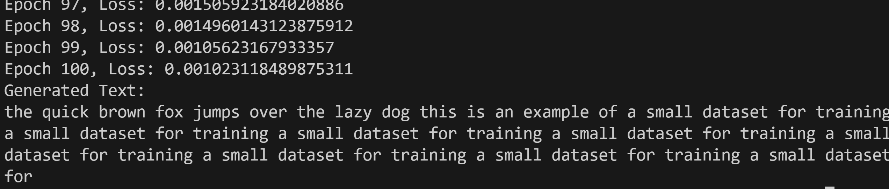

# Building GPT from Scratch
This guide provides step-by-step instructions for setting up the necessary environment within WSL Ubuntu to run the code presented in the accompanying blog post. 

## Prerequisites

* **WSL Ubuntu:** Ensure you have WSL Ubuntu installed and running.

## Setting Up the Environment

1. **Create a Project Directory:**
   ```bash
   cd gpt
   ```

2. **Create a Virtual Environment:**
   ```bash
   python3 -m venv .venv
   source .venv/bin/activate
   ```

3. **Install Dependencies:**

   * **Create `requirements.txt`:**
     ```bash
     echo "torch numpy" > requirements.txt 
     ```

   * **Install from `requirements.txt`:**
     ```bash
     pip install -r requirements.txt
     ```

4. **Optional: Install IPython Kernel and Jupyter Notebook:**

   * **Install Packages:**
     ```bash
     pip install ipykernel notebook
     ```

   * **Install Kernel:**
     ```bash
     python -m ipykernel install --user --name=gpt 
     ```

## Running the Code

1. **Copy Python Code:** Copy the Python code from the blog post into a file named `gpt_model.py` within the project directory.

2. **Execute the Code:**

   * **Direct Execution:**
     ```bash
     python gpt_model.py 
     ```
    you will get 

    


   * **Within Jupyter Notebook:**
     * Launch Jupyter Notebook:
       ```bash
       jupyter notebook
       ```

     * Select the `gpt` kernel when creating a new notebook.

     * Copy the code from `gpt_model.py` into the notebook cells.

     * Execute the cells to train the model and generate text. 

## Explanation

* **Virtual Environment (`.venv`)**: This isolates the project's dependencies, preventing conflicts with other Python projects.
* **`requirements.txt`**: Lists the required Python packages for easy installation.
* **IPython Kernel and Jupyter Notebook (Optional)**: Enable interactive code execution and experimentation. 

## Key Points

* The provided code demonstrates the core concepts of building a basic Transformer architecture.
* Adapt and experiment with this code to further explore the capabilities of Transformer models.
* Refer to the blog post for detailed explanations of the code and underlying concepts. 

**Remember:** 

* The `requirements.txt` currently includes only `torch` and `numpy`. Add any additional libraries your code might need (e.g., `re`, `collections`).
* Ensure you're in the activated virtual environment whenever you install packages or run the code.
* If using Jupyter Notebook, make sure you've selected the correct kernel associated with the virtual environment (`gpt` in this example). 
